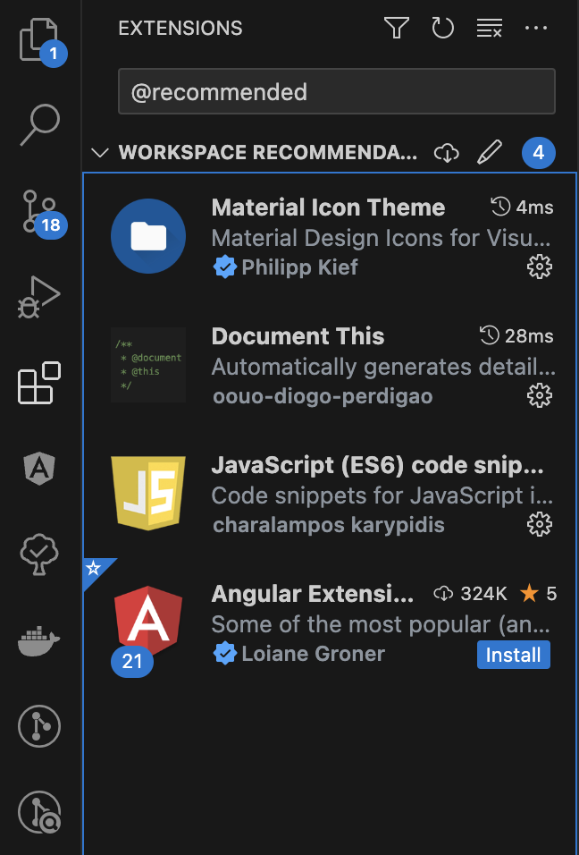

# angular-boilerplate-standalone

- [angular-boilerplate-standalone](#angular-boilerplate-standalone)
  - [一、專案說明](#一專案說明)
    - [特點](#特點)
  - [二、專案環境和套件](#二專案環境和套件)
    - [環境設置](#環境設置)
    - [VScode Extension安裝](#vscode-extension安裝)
  - [三、專案啟動](#三專案啟動)
  - [四、專案Commit](#四專案commit)
  - [五、指令](#五指令)
  - [六、專案資料夾結構](#六專案資料夾結構)

## 一、專案說明

這是一個基於`Angular 16` 框架的模板專案，是以`Standalone`為架構; 搭配`Google`的[gts](https://github.com/google/gts)，對專案的程式碼和排版進行統一的規範和檢核。

[](https://github.com/google/gts)

### 特點

1. `Angular16`版本並使用`Standalone`架構
2. 使用程式碼、提交訊息檢核和排版工具(`ESLint、Commitizen、Prettier`)
3. 使用 [Google Code Style](https://github.com/google/gts)
4. 搭配使用`VScode Extension`在檔案儲存時自動排版和Lint
5. Commit時會進行程式語法檢核強制排版以確保每次提交都有一致性。

## 二、專案環境和套件

### 環境設置

| 檔案                                         | 版本                 |
| -------------------------------------------- | -------------------- |
| [Node.js](https://nodejs.org/zh-tw/download) | ^16.14.0 或 ^18.10.0 |
| [git](https://git-scm.com/downloads)         | 不限                 |
| [Angular cli](https://angular.io/cli)        | 16版                 |

### VScode Extension安裝


請在`EXTENSIONS`內搜尋`@recommended`(如上圖)，會看到推薦安裝的Extensions，請全部安裝下來。

## 三、專案啟動

輸入以下指令，進行套件安裝

```bash
npm install
```

待安裝完套件後輸入以下指令來啟動專案

```bash
ng serve
```

## 四、專案Commit

請輸入以下指令，以便呼叫出Commitizen工具協助進行Commit訊息的撰寫

```bash
npm run commit
```

## 五、指令

- `ng serve` - 啟動開發服務器。
- `ng build` - 產生打包。
- `npm test` - 運行單元測試。
- `npm run lint` - 執行程式碼檢查。
- `npm run commit`- 使用 Commitizen 提交變更。

## 六、專案資料夾結構

```text
🔸 表示當前專案沒有該檔案，在此列出是為了顯示結構，可以依照需求自行新增。

- 📂 angular-boilerplate-standalone
  - 📂 .angular
  - 📂 .vscode (vscode設定)
  - 📂 .husky (husky設定)
  - 📂 e2e
  - 📂 node_modules (引用套件)
  - 📂 src
      - 📂 app
          - 📂 core（共用工具模組)
               - 📂 enums (列舉宣告)
                   - 📄 common.enum.ts
               - 📂 guards (路由守衛)
               - 📂 utils （輔助工具）
                   - 📄 common-utils.ts
               - 📂 consts (常數宣告)
                   - 📄 common.consts.ts
               - 📂 models (通用資料模型)
                   - 📄 a.model.ts 🔸
                   - 📄 b.model.ts 🔸
               - 📂 services (通用服務: 如Storage)
               - 📂 validators (驗證器) 🔸

               - 📂 interceptors
          - 📂 features（各功能模組）
               - 📂 feature-a 🔸
                    - 📄 feature-a.component.html
                    - 📄 feature-a.component.scss
                    - 📄 feature-a.component.ts
                    - 📄 feature-a.component.spec.ts
                    - 📂 models(該功能會使用到的資料模型）
          - 📂 shared (共用元件)
               - 📂 components（共用元件，例:dialog、toast）
               - 📂 pipes
               - 📂 directives
               - 📂 layout (畫面框架元件，例：header、navbar等)
          - 📄 app.component.html
          - 📄 app.component.scss
          - 📄 app.component.ts
          - 📄 app.module.ts
          - 📄 app.routing-module.ts
     - 📂 assets(靜態資源)
         - 📂 images (圖片)
         - 📂 data (API假資料) 🔸
         - 📂 scripts (外部js) 🔸
         - 📂 icons 🔸
     - 📂 styles(樣式檔案）
          - 📄 _custom.scss 🔸（外部套件樣式）
          - 📄 styles.scss
     - 📂 environments(環境變數)
          - 📄 environment.ts
          - 📄 environment.prod.ts
     - 📄 index.html
     - 📄 main.ts
     - 📄 polyfills.ts
  - 📄 .eslintrc.json
  - 📄 .eslintignore.json
  - 📄 .lintstagedrc.json
  - 📄 .gitignore
  - 📄 .commitlint.config.js
  - 📄 angular.json
  - 📄 package.json
  - 📄 tsconfig.json
  - 📄 README.md
```
